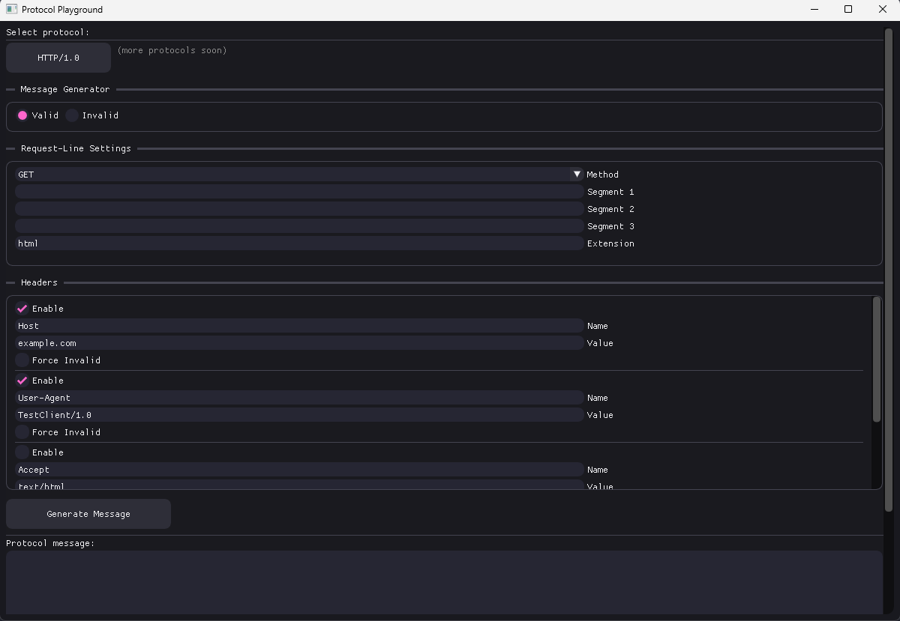
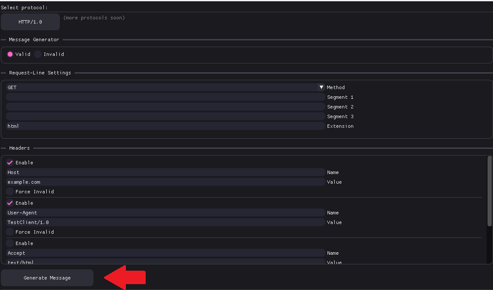
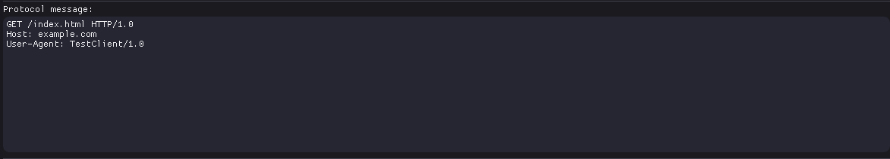
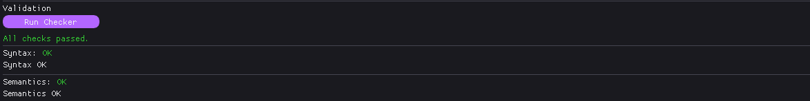
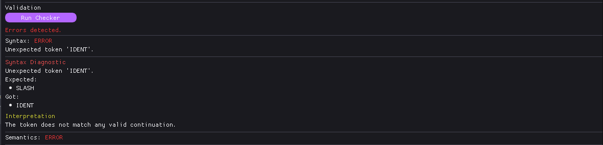
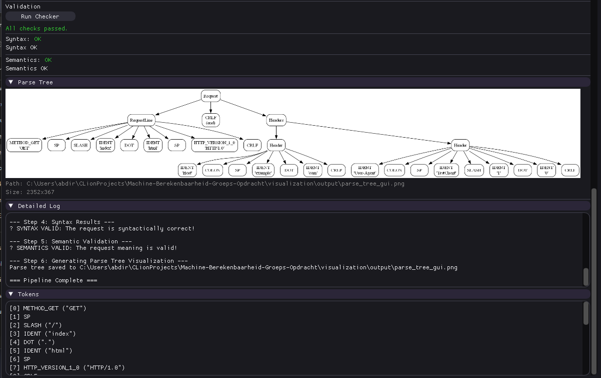

# Protocol Validator — Machine Berekenbaarheid

## Projectomschrijving

Dit project implementeert een **Protocol Validator**: een systeem dat netwerkberichten controleert op **syntactische en semantische correctheid** op basis van **formele grammatica’s**.

Het doel is om aan te tonen hoe concepten uit de cursus *Machine Berekenbaarheid* rechtstreeks toegepast kunnen worden op realistische netwerkprotocollen, zoals HTTP/1.0 en kan uitgroeien tot complexere protocollen zoals HTTP/2 of zelfs op maat gemaakte protocollen.

---

## Probleem & Doelstelling

Veel netwerkproblemen ontstaan door **fout gestructureerde berichten**.  
Deze kunnen leiden tot:
- crashes
- onverwacht gedrag
- of zelfs beveiligingsproblemen

Het doel van dit project is een tool te bouwen die **automatisch verifieert** of een netwerkbericht:
- grammaticaal correct
- semantisch geldig
- eventueel ambigu

---

## Theoretische Basis

Het systeem steunt volledig op de kernconcepten uit de cursus:

- **Pushdown Automata (PDA)** voor het modelleren van geneste structuren
- **Context-Free Grammars (CFG)**
- Normalisatie naar **Chomsky Normal Form (CNF)**
- **CYK-algoritme** voor lidmaatschapstests
- **LL(1)** parsing voor snelle foutdetectie
- **SLR parsing** voor deterministische bottom-up analyse

---

## Implementatie

De implementatie bestaat uit de volgende componenten:

## PDA → CFG

Complexe protocolstructuren (zoals geneste headers of herhaalde velden) worden eerst gemodelleerd met een **PDA**.

Deze PDA wordt automatisch omgezet naar een **CFG**, zodat alle verdere algoritmes uniform op dezelfde grammaticale representatie kunnen werken.

---

## CNF & CYK

Elke grammatica wordt:
1. vereenvoudigd,
2. omgezet naar **Chomsky Normal Form**,
3. geanalyseerd met **CYK**.

CYK geeft een **antwoord** op de vraag of een bericht tot de taal behoort, zelfs bij ambiguïteit.

---

## LL(1) & SLR Parsing

We gebruiken twee parsers met complementaire eigenschappen:

- **LL(1)**
    - snelle foutmeldingen
    - duidelijke *expected tokens*
- **SLR**
    - deterministische bottom-up parsing
    - detecteert grammaticale conflicten

Samen zorgen ze voor **efficiënte én precieze analyse**.

---

## Ambiguïteitsdetectie

Het systeem detecteert of een bericht **meerdere parsebomen** heeft.

Dit gebeurt door:
- vergelijking van het **CYK parse-forest**,
- met het **SLR-resultaat**.

Bij ambiguïteit genereert het systeem automatisch:
- meerdere parsebomen,
- een **minimaal tegenvoorbeeld** dat de ambiguïteit aantoont.

---

## Gebruik & Demo

De applicatie bevat een grafische interface (*Protocol Playground*) waarmee gebruikers eenvoudig
protocolberichten kunnen genereren, analyseren en valideren.

### Protocolselectie

Bovenaan kan een protocol geselecteerd worden. Momenteel is **HTTP/1.0** geïmplementeerd.
De architectuur is uitbreidbaar zodat later meerdere protocollen toegevoegd kunnen worden.

---

### Berichtgeneratie (Valid / Invalid)

De gebruiker kan kiezen tussen:
- **Valid**: genereert automatisch een grammaticaal correct protocolbericht
- **Invalid**: forceert een fout om syntactische of semantische fouten te testen

Via de *Request-Line Settings* en *Headers* kan het bericht verder aangepast worden
(bv. methode, pad, headers, waarden).

Na het aanpassen van de instellingen wordt het bericht gegenereerd via **Generate Message**.

---

### Gegenereerd protocolbericht

Onderaan verschijnt het gegenereerde protocolbericht in tekstvorm.
Dit is exact het bericht dat vervolgens door de validator wordt geanalyseerd.

---

### Validatie uitvoeren

Door op **Run Checker** te klikken, start de volledige validatiepipeline:

- syntactische analyse
- semantische validatie
- parse tree generatie
- logging en tokenisatie

Bij een geldig bericht verschijnt een duidelijke bevestiging:

Bij een ongeldig bericht worden de fouten duidelijk gemarkeerd:

---

### Validatie-resultaten (tabs)

De resultaten worden overzichtelijk getoond in verschillende tabs:

- **Syntax**  
  Geeft aan of het bericht grammaticaal correct is, met duidelijke foutmeldingen indien niet.

- **Semantics**  
  Controleert of het bericht betekenisvol is volgens de protocolregels.

- **Parse Tree**  
  Toont de gegenereerde parseboom van het bericht (gevisualiseerd via Graphviz).

- **Detailed Log**  
  Geeft een stap-voor-stap overzicht van de volledige analysepipeline.

- **Tokens**  
  Toont de getokeniseerde invoer met terminal-symbolen en lexemes.

---

### Samenvatting

Deze interface maakt het mogelijk om:
- snel geldige en ongeldige protocolberichten te testen,
- formele parsing-algoritmes visueel te inspecteren,
- en de volledige analyse transparant te volgen.

De tool verbindt formele taaltheorie met een concrete, interactieve toepassing.
